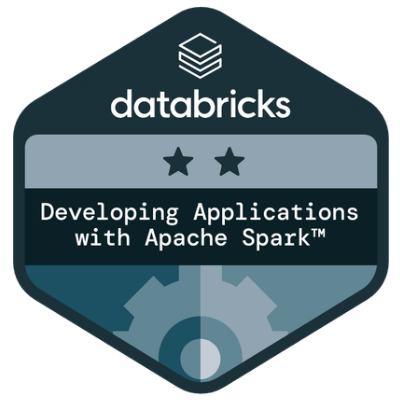
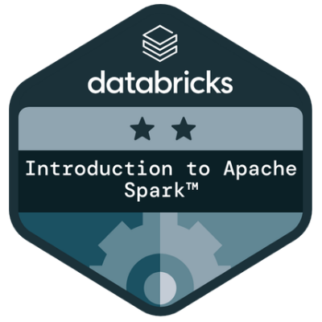
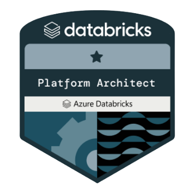
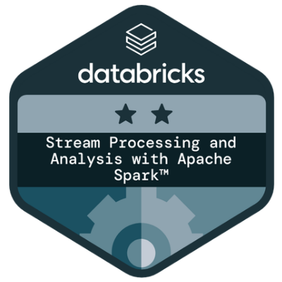
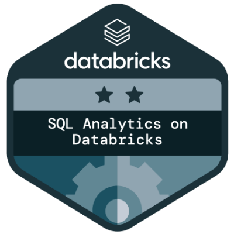
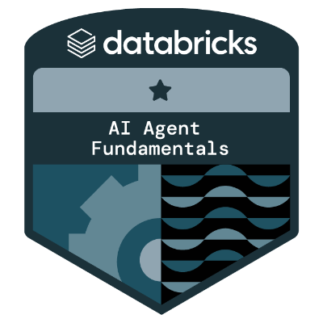
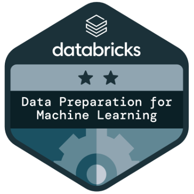
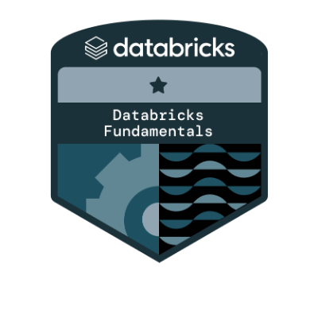
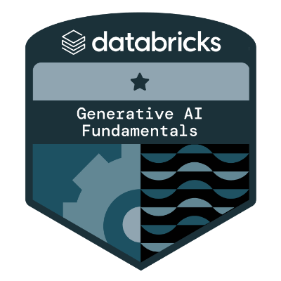

## Hi there Seja bem Vindo👋

---
<h1 align="center">Adriano Santos Costa</h1>

  💼 Data Specialist | Data Engineer  
   
  ⚙️ Spark • Databricks • AWS • Lakehouse  
   
  📍 São Paulo - Brasil

---

## 👨‍💻 Sobre mim

Engenheiro de Dados com mais de 10 anos de experiência em Engenharia de Dados e Analytics, atuando na construção de arquiteturas escaláveis, pipelines distribuídos e sustentação de ambientes de alta performance em cloud.

Especialista em estruturar plataformas de dados orientadas a negócio, com foco em performance, governança, confiabilidade e preparação de dados para iniciativas de Advanced Analytics e Inteligência Artificial.

---

## 🎯 Foco Técnico

- Processamento distribuído com Apache Spark (Batch e Incremental)
- Arquitetura Lakehouse (Bronze / Silver / Gold)
- Modelagem Dimensional e Analítica
- Engenharia de Dados aplicada a projetos de IA
- Otimização de performance (Shuffle, Partitioning, Caching)
- Estratégias de escalabilidade e custo em ambientes cloud
- Data Quality e Governança

---

## 🧠 Databricks & Spark Expertise

- Desenvolvimento e otimização de pipelines no Databricks
- Análise de plano de execução com EXPLAIN
- Monitoramento e troubleshooting via Spark UI
- Estratégias de particionamento e redução de shuffle
- Implementação de arquitetura Medallion
- Delta Lake (OPTIMIZE, ZORDER, VACUUM)
- Workflows e Jobs no Databricks
- Unity Catalog (governança e controle de acesso)
- Databricks SQL e construção de Dashboards
- Integração com Databricks Genie para exploração analítica assistida por IA

---

## 🛠️ Stack Tecnológica

### Linguagens
- Python
- SQL
- PySpark

### Big Data & Plataforma
- Apache Spark
- Databricks
- Delta Lake
- Spark UI
- Databricks SQL

### Cloud
- AWS (S3, IAM, EC2, Glue)

### Engenharia & Observabilidade
- ETL / ELT
- Arquitetura Medallion
- Versionamento com Git
- CI/CD para pipelines
- Monitoramento e análise de performance

---

## 🏆 Certificações e Acreditações

| Certificação | Instituição | Badge |
|--------------|------------|--------|
| Desenvolvimento de Aplicações com Apache Spark | Databricks |  |
| Introdução Apache Spark | Databricks |  |
| Azure Plataform Architect | Databricks |  |
| Stream Processing Analysis Spark | Databricks |  |
| Sql Analytics | Databricks |  |
| AI Agent Fundamentals | Databricks |  |
| Data Preparation for MAchine Learning | Databricks |  |
| Databricks Fundamentals | Databricks |  |
| Databricks Lakehouse Fundamentals | Databricks |  |
| Generative AI Fundamentals | Databricks |  |

---

## 📌 Projetos em Destaque

| Projeto | Descrição | Stack |
|---------|----------|--------|
| Projeto WhatsApp| Automação RPA aplicada ao WhatsApp | Python • openpyxl • pyautogui • Pillow • Pillow | pyautogui • win32clipboard |
| Em construção | Pipeline distribuído com Spark e Delta Lake | Databricks • PySpark • AWS |
| Em construção | Modelagem analítica para ambiente Lakehouse | Spark • SQL |

---

## 📈 Mentalidade de Engenharia

- Performance first  
- Arquitetura limpa e escalável  
- Dados confiáveis como ativo estratégico  
- Engenharia orientada a resultado  
- Estruturação de dados preparada para IA  

---

## 🌎 Conecte-se comigo

🔗 LinkedIn:  
https://www.linkedin.com/in/adriano-costa-bi/

---

  🚀 Transformando dados em vantagem estratégica

